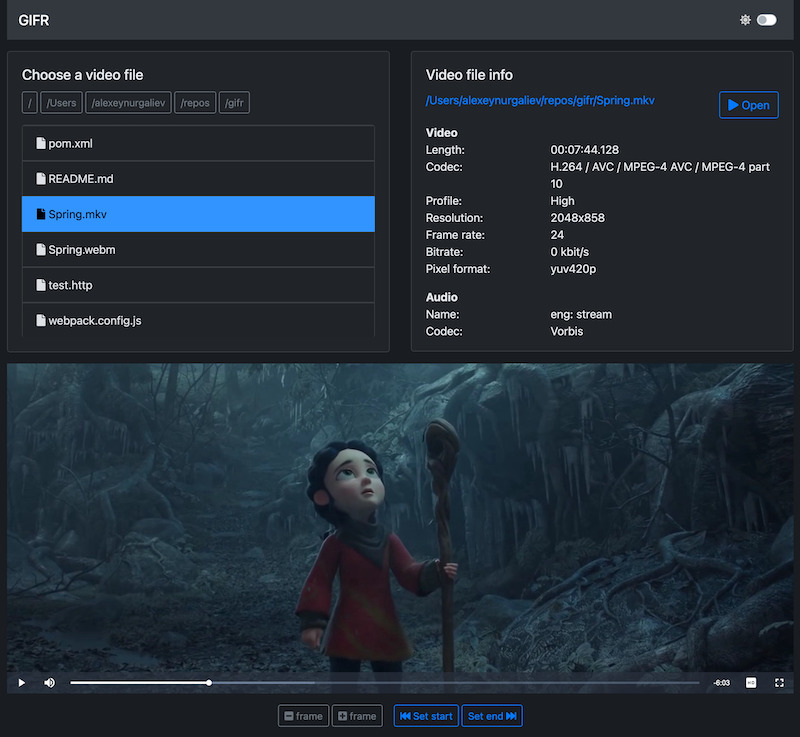

gifr - gif recorder
===================

Streaming video player. It can play any local video file in web browser (and record gifs from it).

Video © Blender Foundation | cloud.blender.org/spring

Features:

* Play local video files with many formats supported, 
  if `ffmpeg` can transcode it - you can play it (mkv, mp4, avi, mov, wmv, webm, ...)
* Preliminary transcoding of whole file not required - it will only transcode parts when it's necessary
* Adaptive video bitrate
* Switch between multiple audio tracks (when part of video container)
* Enable subtitles (when part of video container)
* Save a fragment of video as gif (as project name suggests)

Limitations:

* Minor video or audio artifacts may occur
* For local use only (no security implemented)
* Transcoding depends on performance of the machine (some formats work better, some not)

Building
--------

JDK 11, nodejs 15, npm 7 required.

    npm install
    npm run build
    ./mvnw clean package

Everything will be built in one `target/gifr.jar` file.

Running
-------

Tested only on macOS and Linux systems. `ffmpeg` and `ffprobe` are required in PATH.

Run with `java`:

    java -jar gifr.jar

Or just (since it is an executable jar):

    ./gifr.jar

Go to http://localhost:8080

Configuration
-------------

Default configuration is in `src/resources/application.yml`.

License
-------

BSD-3-Clause
